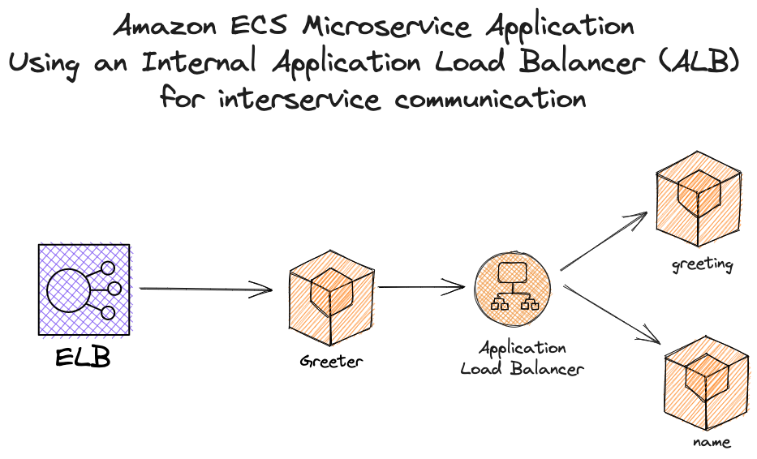
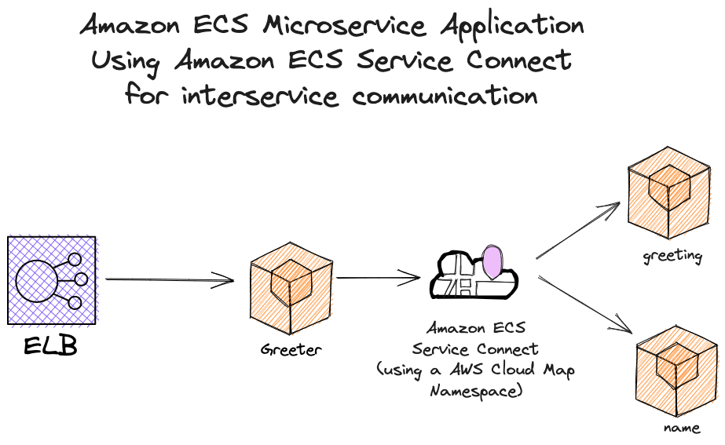

# Simple Greeter Application

Sample code for three microservices that construct a simple greeting.

This repo was created in conjunction with the AWS Blog Post [Migrate Existing Amazon ECS Services using an Internal Load Balancer for interservice communication to Amazon ECS Service Connect](..).

The Greeter application used in this demo was adapated from Nathan Peck's original application [here](https://github.com/nathanpeck/greeter).

This reference architecture provides an easy to use YAML template for deploying a sample Greeter application using an internal load balancer for interservice communication to [Amazon Elastic Container Service (Amazon ECS)](http://docs.aws.amazon.com/AmazonECS/latest/developerguide/Welcome.html) with [AWS CloudFormation](https://aws.amazon.com/cloudformation/).

There are two ways you can launch the [CloudFormation stack](iac/starter-cfn.yml) in your account.

1. You can use the provided [setup.sh](scripts/setup.sh) script located in the `scripts` folder.

To run the provided script, you will need to have the AWS CLI installed on your system, and the minimum required AWS CLI version is `2.9.2`.

The script accepts 4 optional arguments:

1. `AWS_PROFILE`: Name of the AWS CLI profile you wish to use. If you do not provide a value `default` will be used.
2. `AWS_DEFAULT_REGION`: Default Region where Cloud Formation Resources will be deployed. If you do not provide a value `us-west-2` will be used.
3. `ENVIRONMENT_NAME`: Environment Name for the Amazon ECS cluster. If you do not provide a value `ecs` will be used.
4. `CLUSTER_NAME`: Desired Amazon ECS Cluster Name. If you do not provide a value `greeter-cluster` will be used.

To use the setup script with all arguments in the `us-east-2` region, you would run the following command:

```sh
./scripts/setup.sh my-profile us-east-2 my-ecs-environment my-ecs-cluster
```

The setup script will take around 5 minutes to complete.

## Overview



The repository consists of a single cloudformation template that deploys the following:

- An [Amazon VPC](http://docs.aws.amazon.com/AmazonVPC/latest/UserGuide/VPC_Introduction.html) with 2 public and 2 private subnets.
- A highly available Amazon ECS cluster deployed across two [Availability Zones](http://docs.aws.amazon.com/AWSEC2/latest/UserGuide/using-regions-availability-zones.html).
- A pair of [NAT gateways](http://docs.aws.amazon.com/AmazonVPC/latest/UserGuide/vpc-nat-gateway.html) (one in each zone) to handle outbound traffic.
- Three microservices deployed as [Amazon ECS services](http://docs.aws.amazon.com/AmazonECS/latest/developerguide/ecs_services.html) (greeter, greeting, and name).
- An [Application Load Balancer (ALB)](https://aws.amazon.com/elasticloadbalancing/applicationloadbalancer/) to the public subnets to handle inbound traffic.
- Internal Application Load Balancer (ALB) used to handle internal traffic using security groups. Service Discovery and Route 53 is not used.
- Centralized container logging with [Amazon CloudWatch Logs](http://docs.aws.amazon.com/AmazonCloudWatch/latest/logs/WhatIsCloudWatchLogs.html).
- Amazon ECS Service Definitions and Task Defintions for `greeter`, `greeting`, and `name`.

# Why use AWS CloudFormation with Amazon ECS?

Using CloudFormation to deploy and manage services with Amazon ECS has a number of nice benefits over more traditional methods ([AWS CLI](https://aws.amazon.com/cli), scripting, etc.).

#### Infrastructure-as-Code

A template can be used repeatedly to create identical copies of the same stack (or to use as a foundation to start a new stack). Templates are simple YAML- or JSON-formatted text files that can be placed under your normal source control mechanisms, stored in private or public locations such as Amazon S3, and exchanged via email. With CloudFormation, you can see exactly which AWS resources make up a stack. You retain full control and have the ability to modify any of the AWS resources created as part of a stack.

#### Self-documenting

Fed up with outdated documentation on your infrastructure or environments? Still keep manual documentation of IP ranges, security group rules, etc.?

With CloudFormation, your template becomes your documentation. Want to see exactly what you have deployed? Just look at your template. If you keep it in source control, then you can also look back at exactly which changes were made and by whom.

#### Intelligent updating & rollback

CloudFormation not only handles the initial deployment of your infrastructure and environments, but it can also manage the whole lifecycle, including future updates. During updates, you have fine-grained control and visibility over how changes are applied, using functionality such as [change sets](https://aws.amazon.com/blogs/aws/new-change-sets-for-aws-cloudformation/), [rolling update policies](http://docs.aws.amazon.com/AWSCloudFormation/latest/UserGuide/aws-attribute-updatepolicy.html) and [stack policies](http://docs.aws.amazon.com/AWSCloudFormation/latest/UserGuide/protect-stack-resources.html).

## How do I...?

### Change the VPC or subnet IP ranges

The provided [CloudFormation template](iac/starter-cfn.yaml) deploys the following network design:

| Item           | CIDR Range   | Usable IPs | Description                                        |
| -------------- | ------------ | ---------- | -------------------------------------------------- |
| VPC            | 10.0.0.0/16  | 65,534     | The whole range used for the VPC and all subnets   |
| Public Subnet  | 10.0.0.0/19  | 8,190      | The public subnet in the first Availability Zone   |
| Public Subnet  | 10.0.32.0/19 | 8,190      | The public subnet in the second Availability Zone  |
| Private Subnet | 10.0.64.0/19 | 8,190      | The private subnet in the first Availability Zone  |
| Private Subnet | 10.0.96.0/19 | 8,190      | The private subnet in the second Availability Zone |

You can adjust the CIDR ranges used in `Mappings:` section of the [iac/ starter-cfn.yaml](iac/starter-cfn.yaml) template. Below is an example:

```yaml
Mappings:
  # Hard values for the subnet masks. These masks define
  # the range of internal IP addresses that can be assigned.
  # The VPC can have all IP's from 10.0.0.0 to 10.0.255.255
  # There are four subnets which cover the ranges:
  #
  # 10.0.0.0 - 10.0.31.255
  # 10.0.32.0 - 10.0.63.255
  # 10.0.64.0 - 10.0.95.255
  # 10.0.96.0 - 10.0.127.255
  #
  # If you need more IP addresses (perhaps you have so many
  # instances that you run out) then you can customize these
  # ranges to add more
  SubnetConfig:
    VPC:
      CIDR: "10.0.0.0/16"
    Public1:
      CIDR: "10.0.0.0/19"
    Public2:
      CIDR: "10.0.32.0/19"
    Private1:
      CIDR: "10.0.64.0/19"
    Private2:
      CIDR: "10.0.96.0/19"
```

### Generate Load Balancer traffic for Internal Load Balancer

Now that you have your sample application and all required infrastructure deployed, you are ready to generate some traffic using the application endpoint. To do this, use the ./scripts/generate-traffic.sh script by running the following command:

```sh

./scripts/generate-traffic.sh
```

Once the script completes, you will see a message similar to the following:

```sh
Successfully created/updated stack - hey-loadtest

 Running Hey Loadtest with 100 workers and 10,000 requests for 2 minutes...

 Please wait...

Hey Loadtest for: http://public-http-lb-580800901.us-west-1.elb.amazonaws.com/ complete!
View the Amazon EC2 Load Balancer Console here: https://console.aws.amazon.com/ec2/home#LoadBalancers
Be sure to choose the correct region for your deployment.
```

### Migrate from Internal Load Balancer to Amazon ECS Service Connect

Now you are ready to migrate from using an internal load balacner to Amazon ECS Service Connect.

To simplify the commands needed, use the ./scripts/add-service-conect.sh script  by running the following command in the shell environment of your choice:

```sh
./scripts/add-service-connect.sh
```

This will take some time to complete.

Once the script completes, you should see output similar to the following example:

```sh
Checking Cloudformation deployment region...
Cloudformation deployment region found: us-west-1
 
 
Waiting for changeset to be created..
Waiting for stack create/update to complete
Successfully created/updated stack - greeter
Added Amazon ECS Service Connect!
```

After the migration is complete, the sample application architecture will look like this:



A few things to note:

1. This isn't an in-place migration. There will be service interruption when adding Amazon ECS Service Connect because the services will need to be recreated to update the networking configuration.

2. When moving from an internal load balancer to to service connect, you will need to add a service connect namespace to your cloudformation stack. You can do this by adding a `AWS::ServiceDiscovery::PrivateDnsNamespace` resource. If you want to see how this sample app handled this resource creation, see lines 502-507 in `./iac/serviceconnect-cfn.yaml`.

3. You will need to add a service connect configuration to each Amazon ECS Service your application uses. 

4. You will also want to update any dependencies your infrastructure resources rely on. i.e. If you your ECS Services previously relied on ELB Ingress Traffic Rules, you will want to update the dependency to `DependsOn` and reference your Service Connect Namespace resource.

5. When moving from using an internal load balancer to handle your interservice communication, you will have to take note of the security groups your services are using, and the ingress security rules you have in place. Depending on how your application networking is configured, you will likely have to update your security rules to allow traffic from your front end services to communicate directly to your backend services, instead of of using your internal load balancer as the facilitator.

Here's an example:

If you take a look at the `./iac/serviceconnect-cfn.yaml` file, look specifically at lines 394-400. This is the rule this sample greeter application used _BEFORE_ the update to Amazon ECS Service Connect. 

```yaml
  BackendServiceIngressfromInternalLoadBalancer:
    Type: AWS::EC2::SecurityGroupIngress
    Properties:
      Description: Ingress from the internal ALB
      GroupId: !Ref BackendSecurityGroup
      IpProtocol: -1
      SourceSecurityGroupId: !Ref 'InternalSecurityGroup'
```

As you can see, this is a security group ingress rule allowing the backend security group to communicate to the Internal Security Group, which is then connected to the Internal Load Balancer. 

The internal load balancer is then allowed to communicate with the greeter service using an additional ingress rule defined on lines 378-384:

```yaml
  InternalLoadBalancerIngressFromGreeter:
    Type: AWS::EC2::SecurityGroupIngress
    Properties:
      Description: Ingress from greeter
      GroupId: !Ref InternalSecurityGroup
      IpProtocol: -1
      SourceSecurityGroupId: !Ref 'GreeterSecurityGroup'
```

This rule will no longer work with service connect since the internal load balancer will no longer be used. Instead, you will want to add a rule allowing direct communication from the security group(s) your frontend service(s) uses to the security group(s) your backend service(s) uses. Here's an example we used in this sample app:

```yaml
  BackendServiceIngressfromGreeter:
    Type: AWS::EC2::SecurityGroupIngress
    Properties:
      Description: Ingress from the internal ALB
      GroupId: !Ref BackendSecurityGroup
      IpProtocol: -1
      SourceSecurityGroupId: !Ref 'GreeterSecurityGroup'
```

The two important lines in the above example is `GroupId: !Ref BackendSecurityGroup` and `SourceSecurityGroupId: !Ref 'GreeterSecurityGroup'`. This is telling the greeter application to allow all traffic from the greeter service security group to the the backend security group directly, there by removing the need for an internal security group ingress rule or internal load balancer.

### Clean up

To avoid future charges, clean up the resources created in this blog post. To make it easier, we created a `./scripts/cleanup.sh` script for you to use.

Run the following command:

```sh
./scripts/cleanup.sh
```

> Note: The clean up script will take around 20 minutes to complete.

### Add a new item to this list

If you found yourself wishing this set of frequently asked questions had an answer for a particular problem, please [submit a pull request](https://help.github.com/articles/creating-a-pull-request-from-a-fork/). The chances are that others will also benefit from having the answer listed here.

## Contributing

Please [create a new GitHub issue](https://github.com/awslabs/ecs-refarch-cloudformation/issues/new) for any feature requests, bugs, or documentation improvements.

Where possible, please also [submit a pull request](https://help.github.com/articles/creating-a-pull-request-from-a-fork/) for the change.

## License

MIT License

Copyright Amazon.com, Inc. or its affiliates. All Rights Reserved.

Permission is hereby granted, free of charge, to any person obtaining a copy of
this software and associated documentation files (the "Software"), to deal in
the Software without restriction, including without limitation the rights to
use, copy, modify, merge, publish, distribute, sublicense, and/or sell copies of
the Software, and to permit persons to whom the Software is furnished to do so.

THE SOFTWARE IS PROVIDED "AS IS", WITHOUT WARRANTY OF ANY KIND, EXPRESS OR
IMPLIED, INCLUDING BUT NOT LIMITED TO THE WARRANTIES OF MERCHANTABILITY, FITNESS
FOR A PARTICULAR PURPOSE AND NONINFRINGEMENT. IN NO EVENT SHALL THE AUTHORS OR
COPYRIGHT HOLDERS BE LIABLE FOR ANY CLAIM, DAMAGES OR OTHER LIABILITY, WHETHER
IN AN ACTION OF CONTRACT, TORT OR OTHERWISE, ARISING FROM, OUT OF OR IN
CONNECTION WITH THE SOFTWARE OR THE USE OR OTHER DEALINGS IN THE SOFTWARE.
